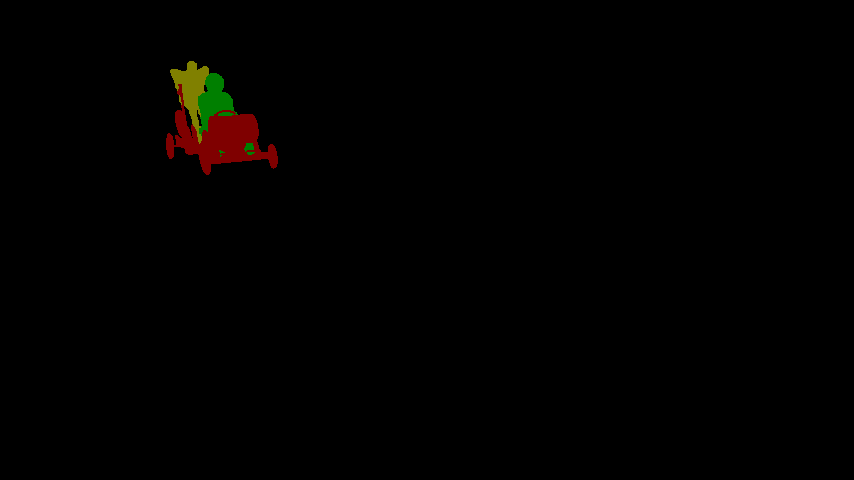

# Video Object Segmentation Demo

Video object segmentation is a task that given an input video, and then output each pixel's class(object class can be 1..N, background class is 0).

## Visualization

Here, we show some visualization results(from DAVIS 2017[1]).

- Input: a video;
- Output: a mask set.
  - mask color represents pixel class.

### 1. Video: Camel

### 2. Video: Soapbox

## Dataset

### Evaluation on DAVIS 2017 val set[1]

| DAVIS 2017 val set | J mean | J recall | J decay | F mean | F recall | F decay | G mean |
| ------------------ | ------ | -------- | ------- | ------ | -------- | ------- | ------ |
| performance        | 0.6736 | 0.7989   | 0.1750  | 0.7273 | 0.8513   | 0.1981  | 0.7004 |
|                    |        |          |         |        |          |         |        |

- J means IoU;
- F means F1-score;
- More bigger mean and recall , the better;
- Less decay, th better.

## Reference

[1]Pont-Tuset J, Perazzi F, Caelles S, et al. The 2017 davis challenge on video object segmentation[J]. arXiv preprint arXiv:1704.00675, 2017.
